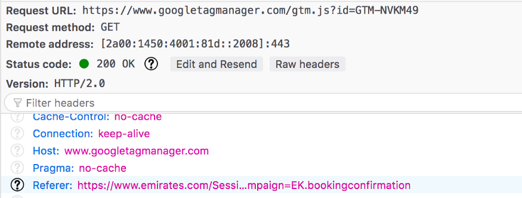

Google Analytics is the most used web analytics service over the web, Google has made it pretty easy and effective in terms of implementation and dashboard UI. It gives detailed demographic data and many other features that justify its vast usage.
The most common and easiest way to enable google analytics on any website is by adding the tag manager (the code snippet provided) to the website.

```HTML
<!-- Global site tag (gtag.js) - Google Analytics -->
<script async src="https://www.googletagmanager.com/gtag/js?id=UA-XXXXXXXXX-1"></script>
<script>
  window.dataLayer = window.dataLayer || [];
  function gtag(){dataLayer.push(arguments);}
  gtag('js', new Date());

  gtag('config', 'UA-XXXXXXXXX-1');
</script>

```

### Problem

Adding a Tag manager is **allowing google to run some code on your website** whenever someone visits the website or do some action (I would request to read this line once more). Based on the options selected on the analytics UI, Google inserts the scripts into the website, sends the data back with `HTTP requests`. Data includes the complete URL(with query params) and many other details that may be classified as `Personal Identifiable Information(PII)`. [Konark Modi](https://twitter.com/konarkmodi), a privacy advocate, has written a detailed case study on how sensitive user data or PII is getting leaked to third parties, including Google Analytics, in [this blog](https://medium.com/free-code-camp/how-airlines-dont-care-about-your-privacy-case-study-emirates-com-6271b3b8474b).
As a developer, we always want to have complete control over whatever is being served on our website. Google tag managers kind of blow this up.<br/><br/>
<br/>


### Solution

This can be avoided by using **Google Measurement protocol**.

*From the [docs](https://developers.google.com/analytics/devguides/collection/protocol/v1)*
> The Google Analytics Measurement Protocol allows developers to make HTTP requests to send raw user interaction data directly to Google Analytics servers

TLDR; Do not load google scripts but, create and send HTTP requests by yourself. This gives way more control over what you want to send to google and ensures your complete control over your website. You can send Requests for whatever action needs to be recorded for analytics. It can be just page visits, clicks, or any event.

#### How
Analytics tool receives the data via query parameters of the request, a typical request looks like this  
```TEXT
POST /collect HTTP/1.1
Host: www.google-analytics.com

payload_data
```
Mandatory parameters are 
```
v=1              // Version of the tool.
&tid=UA-XXXXX-Y  // Tracking ID / Property ID.
&cid=555         // Anonymous Client ID.
&t=              // Hit Type
```

Google provides a number of parameters in case you want more detailed analytics say for e-commerce, check the parameter guide [here](https://developers.google.com/analytics/devguides/collection/protocol/v1/parameters), some interesting parameters which can be controlled are

- `dr` - Document referrer //  = document.referrer
- `dl` - Location URL // = document.location.origin + document.location.pathname (also may be document.location.search)
- `aip` - Anonymize IP, if present the IP address of the sender will be anonymized // = 1
- `npa` - Disable advertising personalization - if enabled  it won't be used when populating a remarketing audience for "past purchasers" // = 1

**Lesser** the parameters, **lesser** the data sent, **better** the privacy.

Google also provides a tool to check and create a proper hit via [Hit Builder](https://ga-dev-tools.appspot.com/hit-builder/)

If you find this a bit exhausting, then atleast follow the best practices to make sure You are not sending the user's personal data to google.
https://support.google.com/analytics/answer/6366371

**<center>--- Keep your users safe ---</center>**
