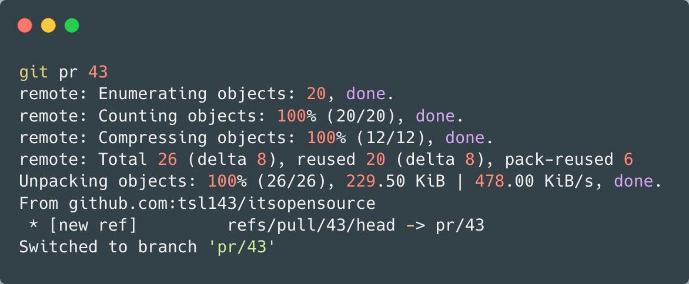

If you work with the repositories hosted on Github , you have to deal with lot of Pull requests daily generally, and the process to checkout the PR's locally in your machie is quite not easy, you have to see the PR's id and also the branch name.

```bash
git fetch origin pull/ID/head:BRANCHNAME
```

And if the PR is in upstream repository, first you need to add that particular user as remote in your local copy of the project and then pull the particular branch of the contributor. For example

```bash
git remote add fayem git@github.com:fayepal/itsopensource.git
git checkout -b fayem fayepal/blog-docker-vm
```

As we see its quite long process and you will have lot of remote added in your repository as well.

To solve this there is a awesome [git alias](https://gist.github.com/gnarf/5406589) by gnarf:

```bash
[alias]
  pr  = "!f() { git fetch -fu ${2:-$(git remote |grep ^upstream || echo origin)} refs/pull/$1/head:pr/$1 && git checkout pr/$1; }; f"
  pr-clean = "!git for-each-ref refs/heads/pr/* --format='%(refname)' | while read ref ; do branch=${ref#refs/heads/} ; git branch -D $branch ; done"
```


Either you can add them directly in your `.gitconfig` file or by doing so:


```bash
git config --global alias.pr '!f() { git fetch -fu ${2:-$(git remote |grep ^upstream || echo origin)} refs/pull/$1/head:pr/$1 && git checkout pr/$1; }; f'
git config --global alias.pr-clean '!git for-each-ref refs/heads/pr/* --format="%(refname)" | while read ref ; do branch=${ref#refs/heads/} ; git branch -D $branch ; done'
```

Now you simply do `git pr x` and it will do the magic for you:



Cheers

