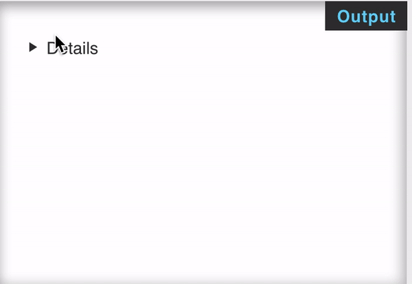

How frequently we have to write JS to make an widget that shows and hides some content for our FAQ section? But do you know about the [`<details>`](https://developer.mozilla.org/docs/Web/HTML/Element/details).

I recently get to know about the `<details>` tag of HTML.Its another hidden gem in HTML elements.

You can simply design simple FAQ or summary section with `<details>` html tag without using Javascript and its really mind blowing 🤯. And it is supported by all the modern browsers (who cares about IE :P).

### Using `<details>` tag

There are two elements here: `<details>` and `<summary>` which is optional. `<details>` is the wrapper for all the content you want to show and hide, and <summary> contains the — well, the summary and title of the section. Technically we don’t need the <summary>. If you do not add it, the browser will use some default text for example in Firefox and Chrome it is `Details`. Below is an HTML markup:

```html
<details>
  <summary>Details</summary>
  <p>Something small enough to escape casual notice.</p>
</details>
```

And it will render like:



And its just simple HTML, no CSS or Javascript, is not it amazing

### More information

For some more background on the details and summary elements, and the concept of disclosure widgets and accordions checkout:

* [MDN: details](https://developer.mozilla.org/en-US/docs/Web/HTML/Element/details)

Cheers.