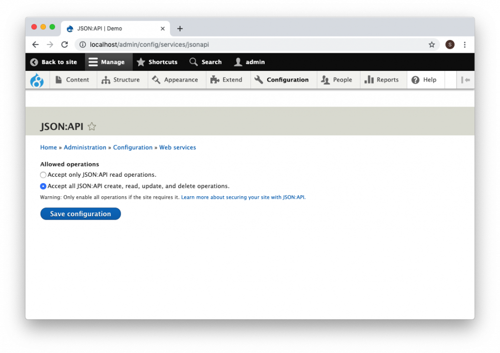
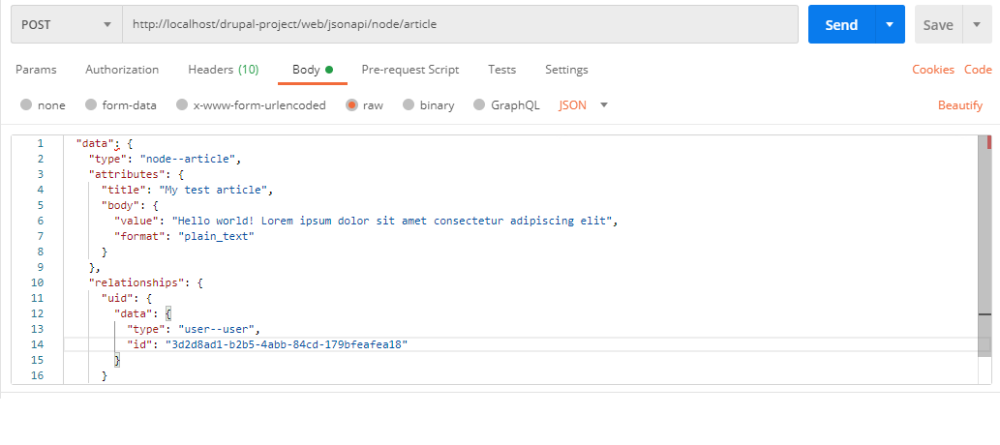
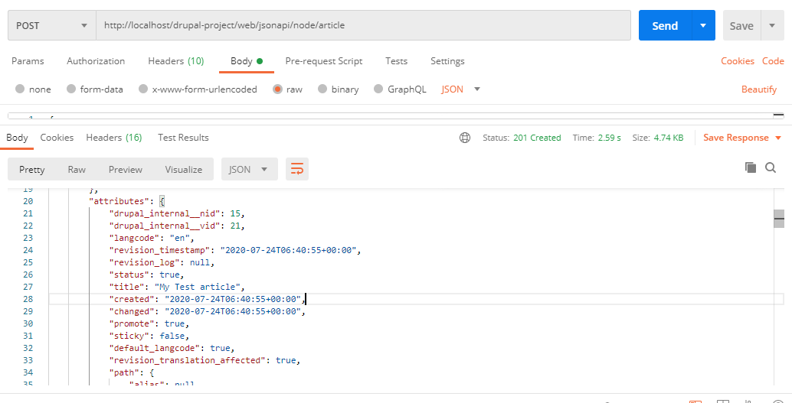
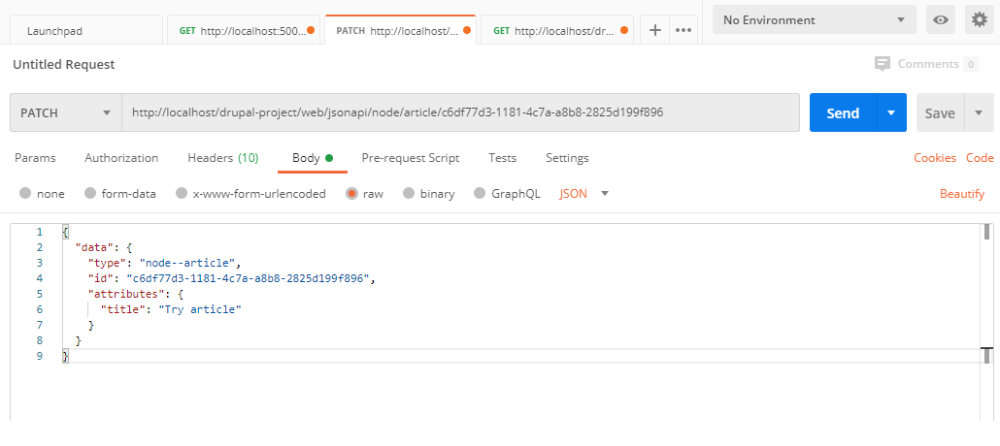
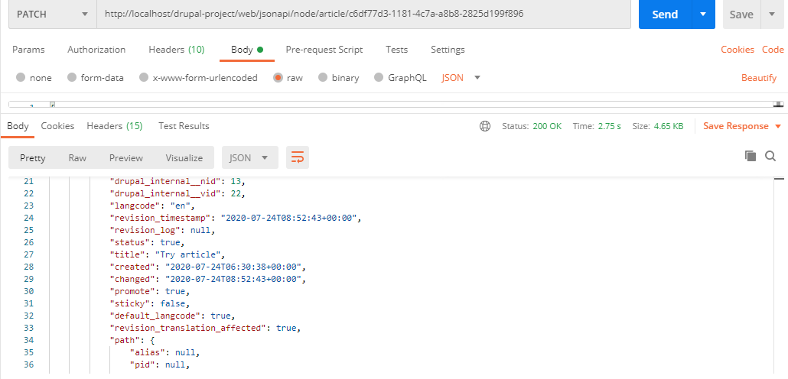
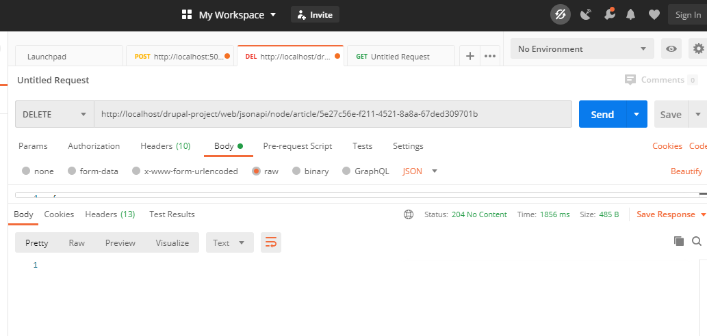

What are the benefits of decoupled architecture?  
A decoupled architecture does great work in reducing or completely eliminating problems that are a part of the monolithic content management systems.
CMS data is exposed to and consumed by a front-end JavaScript framework. The framework can be React.js, Angular.js, and many more.

### Json API
In JSON API, the consumer can get all the data with a single query, tracing relationships between objects and returning the desired output in a single shot.
A single request from a consumer can return multiple entities. For the same API, different consumers may use different embedding patterns, depending on the requirement.
All API can be customized according to the requirement which we can achieve by downloading and enabling JSON:API Extras module.

### Enable json API
```BASH
Using Drush
$ drush en serialization -y
$ drush en jsonapi -y
$ drush dl jsonapi_extras && drush en jsonapi_extras -y

Using Drupal Console
$ drupal module:install serialization
$ drupal module:install jsonapi
$ drupal module:download jsonapi_extras && drupal module:install jsonapi_extras
```

### Configuration

JSON:API is a zero-configuration module that gives access to all Drupal entities for reading out of the box.
You need to go to the module settings page *`(/admin/config/services/jsonapi)`* and make the changes according to the requirement.



### Retrieving resources with JSON API

JSON API specification recommends that all requests include an Accept header with the correct MIME type for JSON API, 
the JSON API module accepts requests without any request headers present.

**Retrieving resource collections**  
Key motivations for using JSON API instead of REST is the possibility of retrieving multiple resources using JSON API collections. 
There is only Views rest export to get the collection entities can be retrieved. In JSON API, simply issue a GET request against the following URL to retrieve a collection of entities eg for articles:
`/jsonapi/node/article`

Using JSON API specification, you can use certain query parameters to operate on the collections retrieved through the API. 
Eg :  page[limlit],sort
`/jsonapi/node/article?sort=nid`
`/jsonapi/node/article?page[limit]=30&page[offset]=25`
`/jsonapi/node/article?page[limit]=30`

**Retrieving limited subsets of fields**  
To capture only the title, created and modified timestamps, and body of the entity, you can provide fields query parameter.
Note that with the parameter, the type and bundle must be included as well.

`/jsonapi/node/article?fields[node--article]=title,created`

### Creating resources with JSON API
The JSON API specification allows for individual resources to be created through an API.
The following request headers are obligatory on all POST requests in order to generate a standard response:

`Accept: application/vnd.api+json`
`Content-Type: application/vnd.api+json`

To POST request that creates an article, use the same URL that we used to retrieve collections of articles:

`/jsonapi/node/article`
For creating an article, you can include a relationship to a user to indicate that they were the one to create the article.
The following payload reflects a relationship that connects the entity to an existing user ({{user_uuid}}) 
whose authorship is assigned in this POST request.

```JSON
{
  "data": {
    "type": "node--article",
    "attributes": {
      "title": "My snazzy new article",
      "body": {
        "value": "Hello world! Lorem ipsum dolor sit amet consectetur adipiscing elit",
        "format": "plain_text"
      }
    },
    "relationships": {
      "uid": {
        "data": {
          "type": "user--user",
          "id": "{{user_uuid}}"
        }
      }
    }
  }
}
```

This request will result in a 201 Created response code with the JSON API response of the created entity.
Sample response from postman




### Updating resources with JSON API

PATCH requests also require the following headers.

`Accept: application/vnd.api+json
Content-Type: application/vnd.api+json`

We use `PATCH` to modifies an article, find the UUID of the article in question and append it to the end of the 
URL, as follows:
`/jsonapi/node/article/{{node_uuid}}`

And include a request payload that contains only the fields that you intend to modify and the UUID of the entity in question:
```JSON
{
  "data": {
    "type": "node--article",
    "id": "{{node_uuid}}",
    "attributes": {
      "title": "Change in article"
    }
  }
}
```





### Deleting resources with JSON API

We can delete the artcile which we have created using `DELETE` method
Headers :
`Content-Type: application/vnd.api+json`

With DELETE requests no payload is required. We need to add the correct resource using its UUID and use the `Delete` method for that URL.
`/jsonapi/node/article/{{node_uuid}}`

It will result in a 204 No Content response code .



### Conclusion

With the evolution of web-based APIs, this json format is a better approach than XML. 
JSON:API has a great experience by making the Drupal entities (users, comments and more) available via a web service API. 
URLs can be manipulated as per the requirement to access the entity types and bundles using HTTP methods.
