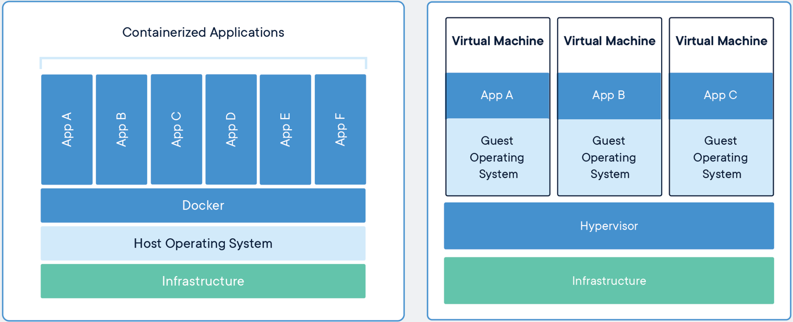

A virtual machine is a system which acts exactly like a computer. A virtual machine makes a physical computing environment, but requests for CPU, memory, hard disk, network and other hardware resources are managed by a virtualization layer which translates these requests to underlayed physical hardware. Itis a abstraction of physical hardware turning one server into many servers means they are isolated from the rest of the system.

While Docker helps you in deploying your applications in a easier way in sandbox (called containers) to run on the host operating system i.e. Mac. Main advantage of docker is that it allows you to package an software with all of its dependencies into a single standardized unit.

Lets understand the difference between Virtual Machine and Docker Containers by every aspect by looking into this image:

Source - [https://www.docker.com/resources/what-container#/package_software](https://www.docker.com/resources/what-container#/package_software)

1. The main difference lies in their architecture, showed above in the image. Virtual machines have host OS and the guest OS inside each VM. In opposite, Docker containers host on a single physical server with a host OS, which shares among them. Sharing the host OS between containers makes them light and increases the boot time. While Docker Containers boot in a few seconds, VMs take few minutes to boot.

2. Docker containers, supports OS virtualization means your application feels that it has a complete instance of an openating system whereas VM supports hardware virtualization.

Cheers!