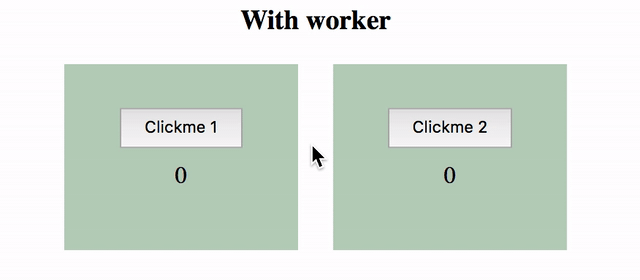

Javascript is single-threaded ie. all of the javascript code written is executed in a single thread. All the functions are executed sequentially. The next function will be executed once the previous one has finished its execution. This sometimes leads to unresponsive UI.
Consider this example, 
In part 1 when we click on button 1, the UI freezes for 2 seconds as the main thread is performing some CPU intensive operations. Until this execution is finished the button 2 is not clickable at all.
 The functionality of button 2 is independent of button 1 but still it's unusable until button 1's job is finished. This is a very common problem faced by javascript intensive web apps.

The solution to this is **Web Workers** (*not Serviceworkers*)

A web worker is a process that executes code independent of the main thread. Workers do not have access to DOM and eventually do not have access to a lot of web APIs. They communicate with the main thread script with `postMessage`.
A worker should be home for all CPU intensive operations which can't be done asynchronously otherwise. It would be an overkill to put a fetch operation in the worker which is already async.

For the given problem, we put the CPU intensive operations in a new file called `worker.js`.

```javascript
// worker.js
let counter = 0
let delay = 2000;
let time = Date.now();
while (Date.now() - time <= delay) {
    counter += 1
}
self.postMessage(counter);
```
<br>
This will be executed as soon as the worker is created we can adjust this to be called only when required via post message.

```javascript
// worker.js
self.addEventListener("message",
  (event) => {
    let data = event.data;
    let counter = 0
    let time = Date.now();
    while (Date.now() - time <= data.delay) {
      counter += 1
    }
    self.postMessage(counter);
  },
false)
```
<br>
Now heading to the main script, we need to include the worker in the main script and send a message to start the computation.

```javascript
if (typeof(Worker) !== "undefined")
  worker = new Worker("./worker.js");
```
<br>
To start computing we just need to post a message to the worker

```javascript
worker.postMessage({ 
  data: data
});
```
<br>
Besides, we add a listener to the worker for receiving the response from the worker

```javascript
worker.onmessage = event => {
  let data = event.data;
  // action with computed result
}
```
<br>
Once the operation is complete and we are sure we do not want to use this worker we need to terminate the worker. For this example, we can terminate the worker once we receive the response.

```javascript
worker.onmessage = event => {
  let data = event.data;
  worker.terminate();
  // action with computed result
}
```
<br>
To put together `script.js` should look like this

```javascript
// script.js
  let data = { delay: 2000 };
  if (typeof(Worker) !== "undefined") {
    let worker = new Worker("./worker.js");
    worker.postMessage({ data: data });
    worker.onmessage = event => {
      let data = event.data;
      worker.terminate();
      // action with computed result
    }
  }
```

The output looks something like this


All the CPU intensive operations are happening in the worker while the UI is free and responsive. The complete code can be found [here](https://github.com/tsl143/itsopensource/tree/master/static/demos/webworkers).

When it comes to loading time workers may not be making your web app load fast, but it ensures the main thread is free and the UI is not frozen. One of the rules I follow is; All UI updates should be done in the main thread and use workers for everything else.
