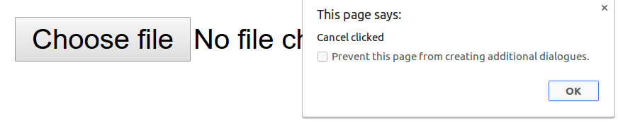

Ever Tried capturing cancel event on Browse file input type in HTML, tbh there is no direct way to do so :(

But there is a workaround adding a bit of javascript. We can play with onfocus event of the BODY element.


Example ->
HTML

```HTML
<input type='file' id='theFile' onclick="initialize()" />
```

```Javascript
var theFile = document.getElementById('theFile');
function initialize()
{
    document.body.onfocus = checkIt;
    console.log('initializing');
}
    
function checkIt()
{
    if(theFile.value.length) 
      alert('Files Loaded');
    else 
      alert('Cancel clicked');
    document.body.onfocus = null;
    console.log('checked');
}		
```

See it working [here](https://tsl143.github.io/jsDemos/handleFileEvent/).

<sub>This blog was first published [here](http://trishulgoel.com/handle-cancel-click-on-file-input)</sub>
