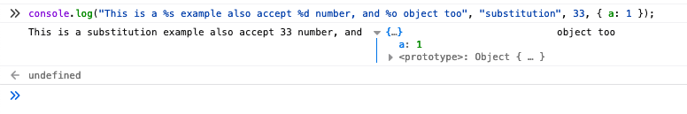
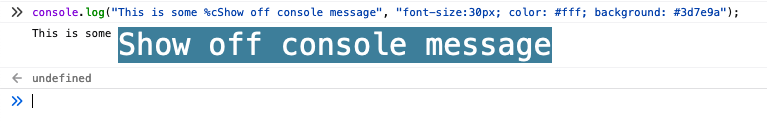
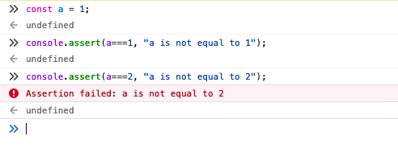
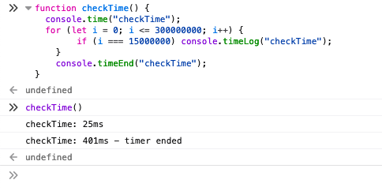
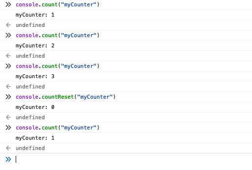

`console.log` is the most widely used debugging technique used by Javascript developers. While debugging `console.log` is sprinkled almost anywhere in the code, after code execution, console panel is full of console messages, this blog mentions some useful console commands which can help to format and declutter console panel for more meaningful console messages.

###<center> console.(log/info/warn/error) </center>
#### Basic usage

```Javascript
console.log(123);
// 123

console.log("abc", 123);
// abc 123

console.log([1,2,3], "abc", 123);
// Array(3) [ 1, 2, 3 ] abc 123
```

#### Substitution in console
```Javascript
console.log("This is a %s example also accept %d number, and %o object too", "substitution", 33, { a: 1 });
```

*Please take care of the sequence of params*

#### Styling in console
`console` accepts CSS styles we can use `%c` to pass CSS styles 😎. Styles apply to whatever text is after `%c`. It can be mixed with substitutions too, but again make sure of the sequence of parameters.

```Javascript
console.log("This is some %cShow off console message", "font-size:30px; color: #fff; background: #3d7e9a");
```


---
###<center> console.assert </center>
This is generally used for conditional logging, accepts a `condition` as the first param, and logs the next params only if the given condition is false with `Assertion failed` error.
```Javascript
const a = 1;
console.assert(a===1, "a is not equal to 1");
//undefined
console.assert(a===2, "a is not equal to 2");
// Assertion failed: a is not equal to 2
```


---
###<center> console.(time/timeLog/timeEnd) </center>
When we try to measure the performance of a website or a function we use to add `console.log(Date.now)` before and after a function and do the maths to get execution time. Javascript has a native way to achieve this. `console.time` marks the start of time, `console.timeEnd` stops the timer and gives the total time taken. `console.time` takes label as a parameter in case you want to use multiple timers. `console.timeLog` can be used anywhere in between to check time elapsed till then.

```Javascript
function checkTime() {
  console.time("checkTime");
  for (let i = 0; i <= 300000000; i++) {
		if (i === 15000000) console.timeLog("checkTime");
	}
	console.timeEnd("checkTime");
}
checkTime();

// checkTime: 24ms
// checkTime: 396ms - timer ended
```


---
###<center> console.(count/countReset) </center>
There are times where we want to count how many times a function is called, we need to create a dummy counter just for logging, `console.count` handles this, every time it is called it increments by 1 and consoles the value against the passed `label` or `default`. We can use multiple counters in the same code with different labels. Any counter can be reset with `console.countRest` passing respective label or nothing in case of `default`.

```Javascript
console.count("myCounter");
// myCounter: 1
console.count("myCounter");
// myCounter: 2
console.count("myCounter");
// myCounter: 3
console.countReset("myCounter");
// myCounter: 0
console.count("myCounter");
// myCounter: 1
```

