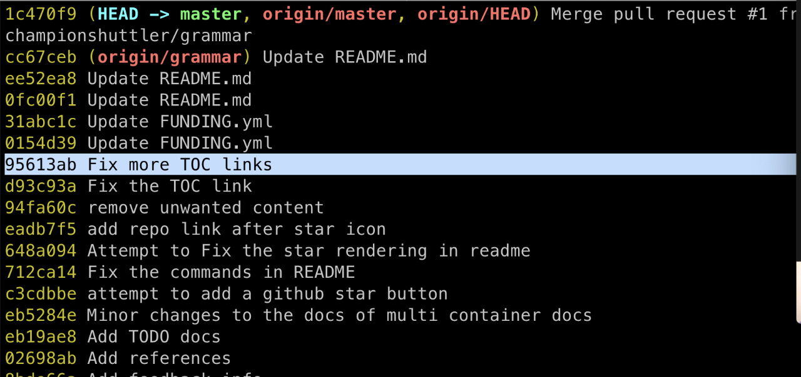
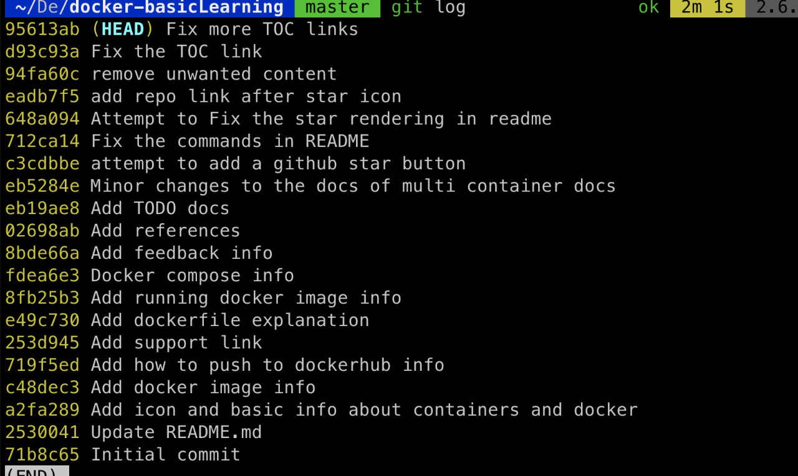
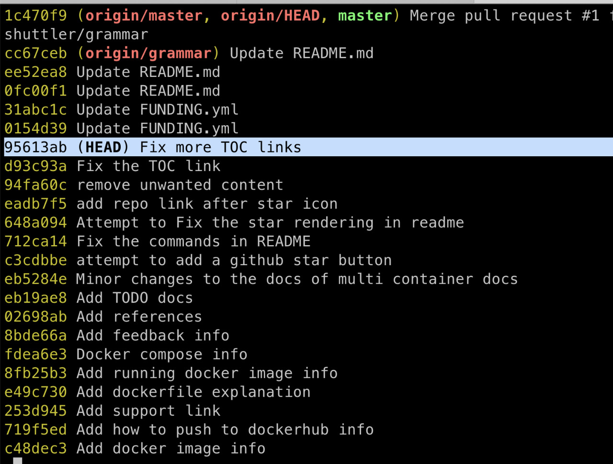

We always keep moving forward and backward between commits in `git`. Once you checked out a previous hash `git log` no more shows the next commits, we end up rebasing or resetting, but git provides a way to see all the commits, and we can checkout the next commits too from a previous state.

The simple and easiest way to do this is:

```bash
git log --online --all
```

Consider this example:



Here if we check out to commit id `95613ab Fix more TOC links` and then see the git history with `git log` or `git log --oneline` you will only see:



As we see here we missed the commits ahead of `95613ab`. You can see the HEAD with `git show-ref --head` but it will not show the commits in between the `HEAD` and the commit you checked out. So if you do `git log --oneline --all` you will get the whole history with the commit where the `HEAD` is right now.




Let us know if you know the better solution for this problem.

Cheers.
