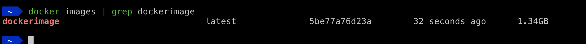
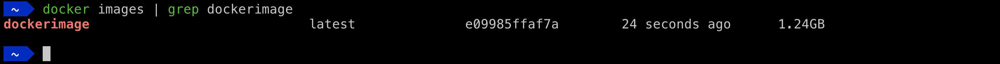
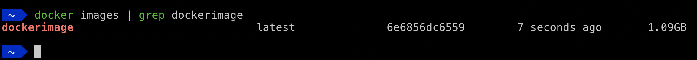
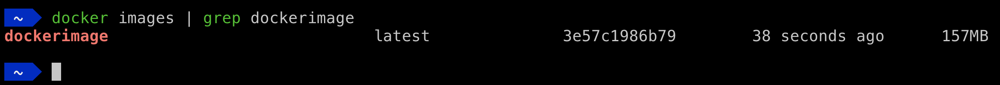

Dockerizing an application is simple, effective, but optimizing the size of Docker Image is the tricky part. Docker is easy to use but once the application starts scaling, the image size inflates exponentially. In general, the node docker image size of the applications is over 1 GB most of the time.

### Why the Size matters

1. Large docker image sizes - Bigger image size requires more space means increased expense.

2. Long build durations - It takes a longer time to push the images over the network and results in CI Pipeline delays.

### Let’s Start The Optimization

Here is our [demo application](https://github.com/championshuttler/fluentbit-dashboard) built using the VueJS Application. 

Here is the initial Dockerfile.

```BASH
FROM node:10

WORKDIR /app

COPY . /app

EXPOSE 8080

RUN npm install http-server -g

RUN npm install && npm run build

CMD http-server ./dist
```

The size of this image is:



It is 1.34GB! Whoops!

Let's start optimizing step by step

1) Use **Multi-Stage** Docker Builds

Multi-stage builds make it easy to optimize Docker images by using multiple **intermediate** images in a single Dockerfile. Read more about it [here](https://docs.docker.com/develop/develop-images/multistage-build/). By using multi-stage builds, we can install all dependencies in the build image and copy them to the leaner runtime image.

```BASH
FROM node:10 AS BUILD_IMAGE

WORKDIR /app

COPY . /app

EXPOSE 8080

RUN npm install && npm run build

FROM node:10

WORKDIR /app

# copy from build image
COPY --from=BUILD_IMAGE /app/dist ./dist
COPY --from=BUILD_IMAGE /app/node_modules ./node_modules

RUN npm i -g http-server

CMD http-server ./dist
```

Now the size of this image is 1.24GB:



2) Remove Development Dependencies and use **Node Prune** Tool

node-prune is an open-source tool for removing unnecessary files from the node_modules folder. Test files, markdown files, typing files and *.map files in Npm packages are not required at all in the production environment generally, most of the developers do not remove them from the production package. By using node-prune it can safely be removed.

We can use this to remove Development Dependencies:

```BASH
npm prune --production
```

After making these changes `Dockerfile` will look like:

```BASH
FROM node:10 AS BUILD_IMAGE

RUN curl -sfL https://install.goreleaser.com/github.com/tj/node-prune.sh | bash -s -- -b /usr/local/bin

WORKDIR /app

COPY . /app

EXPOSE 8080

RUN npm install && npm run build

# remove development dependencies
RUN npm prune --production

# run node prune
RUN /usr/local/bin/node-prune

FROM node:10

WORKDIR /app

# copy from build image
COPY --from=BUILD_IMAGE /app/dist ./dist
COPY --from=BUILD_IMAGE /app/node_modules ./node_modules

RUN npm i -g http-server

CMD http-server ./dist
```

By using this we reduced the overall size to 1.09GB



3) Choose **Smaller Final Base Image**

When dockerizing a node application, there are lots of [base images](https://hub.docker.com/_/node/) available to choose from.

Here we will use **alpine** image; alpine is a lean docker image with minimum packages but enough to run node applications.

```console
FROM node:10 AS BUILD_IMAGE

RUN curl -sfL https://install.goreleaser.com/github.com/tj/node-prune.sh | bash -s -- -b /usr/local/bin

WORKDIR /app

COPY . /app

EXPOSE 8080

RUN npm install && npm run build

# remove development dependencies
RUN npm prune --production

# run node prune
RUN /usr/local/bin/node-prune

FROM node:10-alpine

WORKDIR /app

# copy from build image
COPY --from=BUILD_IMAGE /app/dist ./dist
COPY --from=BUILD_IMAGE /app/node_modules ./node_modules

RUN npm i -g http-server

CMD http-server ./dist
```

By using this `Dockerfile` the image size dropped to `157MB` \o/




### Conclusion

By applying these 3 simple steps, we reduced our docker image size by 10 times.

Cheers!
