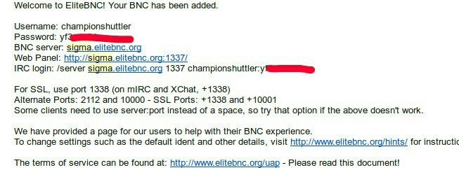
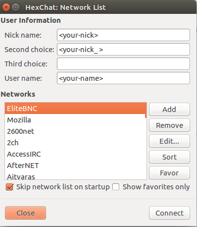
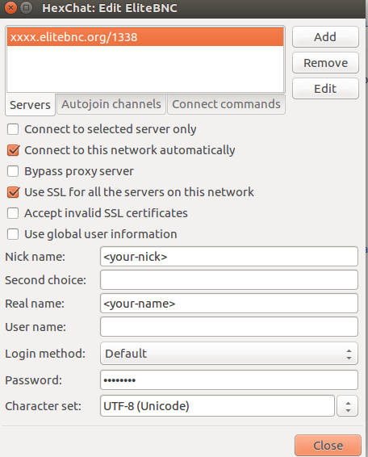

## What is IRC?

[Internet Relay Chat] - IRC is a protocol that provides a way to communicate in real-time with people from all over the world, was invented before the World Wide Web.  It is very similar to text messaging but designed around communicating with large groups of users instead of one on one. It consists of various separate networks (or "nets") of IRC servers, machines that allow users to connect to IRC.

## What is IRC Clients?

An IRC client is the vehicle that connects you to the global network of IRC servers. A variety of applications are available, like WeeChat, HexChat, XChat, Chatzilla, etc. Personally, I am using HexChat. It's awesome and easy to use. We will use HexChat here in this blog for the EliteBNC setup. You can download it from here.

So if you have used IRC before, you must know that unlike other chat systems, IRC doesn't keep when you're offline. In order to be notified of relevant communications, you can either look at the channel logs or set up an IRC bouncer.

## What is an IRC bouncer or BNC?

An IRC bouncer is a middleman between you and an IRC network. It connects to a network like a normal client and instead of connecting directly to an IRC network we can connect to it.

## How to setup IRC Bouncer?

Either you can install it on your own server or get a free BNC from some BNC provider.

A list of bouncer software.

* JBouncer for IRC, written in Java. Supports logging.
* psyBNC is said to be the oldest and most well-known IRC bouncer. It is easy to use, runs on Linux and became popular on FreeBSD, supports IPv4, IPv6, SSL, logging, multiple users and networks, etc.
* BNC is the original IRC bouncer.
* ZNC  is easy to use, supports SSL connections, IPv6 and logging and offers a web interface. It is extendible by modules and scripts in C++, Python, Perl, and Tcl.
* Matrix and Riot has a bouncer included, the simple solution is to get an account on riot.im as they have a client for Android too.
* EliteBNC is the one which we will set up in this blog. It's awesome and easy to use. I am using it. It's well maintained. Thanks to Robby :)

## How to get Bouncer from EliteBNC?

In HexChat, you can set up the EliteBNC by following steps. :)

1. Open HexChat and Join `#elitebnc` channel on Freenode. Command to join any channel on IRC, just type `/join #`.
2. type `!list` it will show all available commands.
3. There are three ways or commands to request BNC, `!request` `!easyreq` and `!emailreq`.
4. To get BNC for Freenode, `send !easyreq <email>`

Now, wait for some time to get the approval of the request. *DO NOT* make multiple requests else Robby will kick you from EliteBNC :P. Once your request gets approved you will receive an email, go ahead and log in to your account. The link would be like https://xxxx.elitebnc.org:1338

where xxxx is the server name, which will be mentioned in the mail sent by EliteBNC eg. Sigma, Theta.

Go to ‘Your settings’ and edit the Freenode network, enable the `NickServ` module so that Freenode will identify you.

You can edit other details in ‘Your settings’

You can use [webchat.freenode.net](https://webchat.freenode.net) to join the channel if you don’t have an IRC client.

## How to connect HexChat to EliteBNC?

Add a new network in HexChat and follow the screenshots.

To do that go to HexChat->Network List or press Ctrl + S . Add a new network and Edit it.

We will be using port 1338, as it is port for SSL (secured) connection.

Finally, you have set up an IRC bouncer. Enjoy :)

Enjoy!
