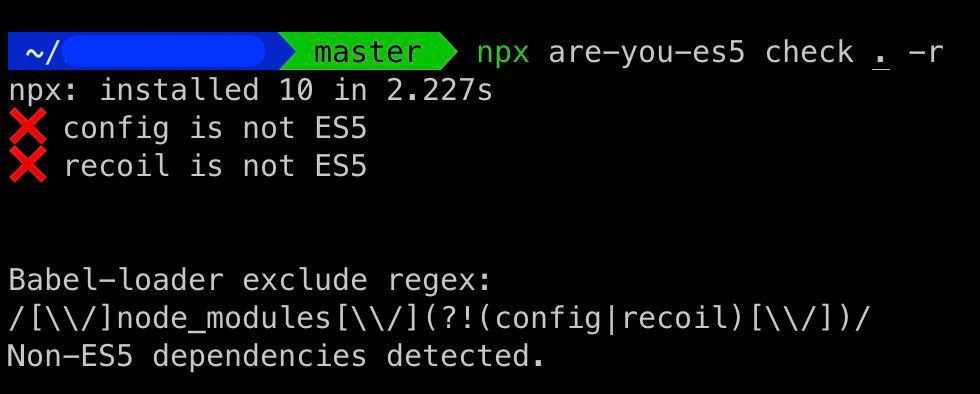

To the delight of Frontend developers around the globe, Microsoft finally decided to kill its dreaded browser Internet explorer. But it's not done yet, and still we need to support IE in  our Frontend builds, due to which almost all our JS bundles are transpiled in ES5 formats.  
We generally exclude all the node modules from the transpilation process as we believe all the npm packages serve ES5 packages, which is not true for every package (learned that hard way ☹️).  
```JS
{
    test: /\.(ts|tsx|js)$/,
    loader: 'babel-loader',
    exclude: /node_modules/
},
```

For example, I am working with an e-commerce app and we have to support IE11 atleast for this app, one fine day our app stopped working on IE and we spent almost 2 days figuring out what's wrong. Turned out a developer introduced new state management library `recoil`, which is an amazing tool. But, it does not serve ES5 build. This broke our application on IE.  
To fix this all we need to do is, not exclude these packages from our transpilation and done.

```JS
{
    test: /\.(ts|tsx|js)$/,
    loader: 'babel-loader',
    exclude: /[\\/]node_modules[\\/](?!(config|recoil)[\\/])/
},
```

But still, we need to find manually which packages are not being served as ES5. While figuring out this problem I stumbled upon an amazing tool that automatically identifies all non-ES5 packages for us in the node modules [are-you-es5](https://www.npmjs.com/package/are-you-es5). And in bonus, it provides a regex to exclude these packages from our excluding node modules from transpilation. 



