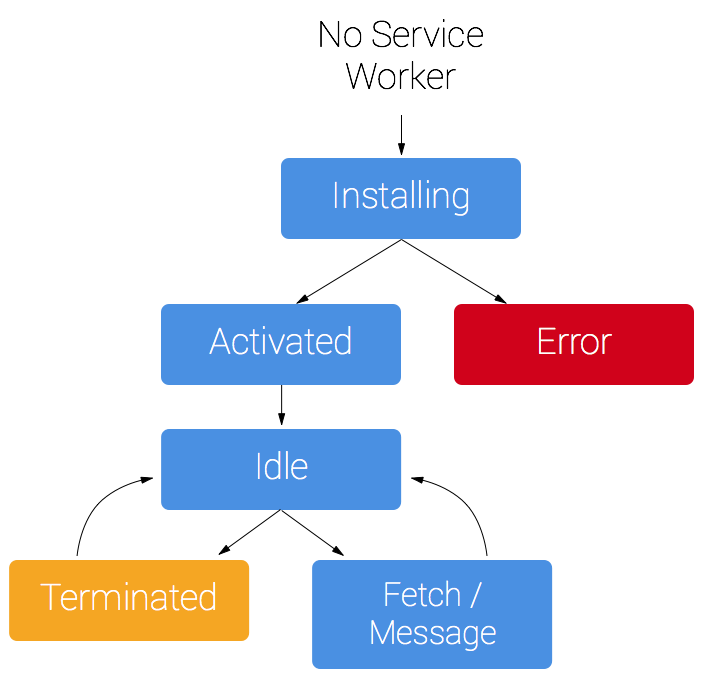

Caching always has proven to be the winner when it comes to **performance**.
Browser by default caches the resources on its end, but to get these resources it still needs the internet. A browser can serve resources from its cache only when a network request is made

Service workers provide a way to bypass the network request. It sits between the network and browser and can decide where to serve resources from.

The basic lifecycle of the service worker is as follows:


***
### Setup

**Register Service worker:**  
We need to check if the [browser supports](https://caniuse.com/#feat=serviceworkers) service workers and then register by providing the path to the serviceworker file.

<center><sub>In Page</sub></center>

```javascript
if ('serviceWorker' in navigator) {
  navigator.serviceWorker.register('/service-worker.js');
}
```

**Install Service worker:**  
When the service worker is installed (initiated by the script from website), we need to define the resources which we wish to cache, These are cached and linked to specific `Cache` key.  
Ideally, we should not cache any third-party resource but only of which are served from the same domain.
<center><sub>In Service worker</sub></center>

```javascript
self.addEventListener('install', function (event) {
	event.waitUntil(
		caches.open('cache-key').then(function (cache) {
			return cache.addAll(
				[
					'/css/style.css',
					'/js/script.js',
					'/index.html'
				]
			);
		})
	);
});
```

**Activate Service worker:**  
In this step we can delete all the unused cache and also bump the cache version (using cache-key).
<center><sub>In Service worker</sub></center>

```javascript
self.addEventListener('activate', function (event) {
	event.waitUntil(
		caches.keys().then(function (cacheName) {
			return Promise.all(
				cacheName.filter(function (name) {
					return name !== 'cache-key';
				}).map(function (name) {
					return caches.delete(name);
				})
			)
		})
	)
});
```

**Handle network request:**  
Listen to the fetch event and capture the network request, depending on your cache strategy handle and return the response.
<center><sub>In Service worker</sub></center>

```javascript
self.addEventListener('fetch', function (event) {
	event.respondWith(
		caches.match(event.request).then(function (response) {
			if (!response) response = fetch(event.request);
			return response;
		})
	);
});
```

***
### Caching techniques

*  *Cache only* - This serves the files only and only from the cache, it will never make a network request. Use this if you don't want to update your resource frequently  

<center><sub>In Service worker</sub></center>

```javascript
self.addEventListener('fetch', function(event) {
  event.respondWith(caches.match(event.request));
});
```

*  *Cache, fallback Network* - This serves the files from the cache if the file fails to load from the cache it will make a network request.  

<center><sub>In Service worker</sub></center>

```javascript
self.addEventListener('fetch', function (event) {
	event.respondWith(
		caches.match(event.request).then(function (response) {
			if (!response) response = fetch(event.request);
			return response;
		})
	);
});
```
*  *Network, fallback Cache* - This makes first a network request and if network request fails then it fallbacks to cache response, please note the cache will be returned only when the network request is completed and gives a failed response.

<center><sub>In Service worker</sub></center>

```javascript
self.addEventListener('fetch', function (event) {
	event.respondWith(
		fetch(event.request).catch(function () {
			return caches.match(event.request);
		})
	);
});
```
*  *Cache then network* - The response is first served from the cache on the page, and then network request is made. When the response from network request is received then again the response is served and the page is updated (or whatever the logic required to do). 

<center><sub>In Page</sub></center>

```javascript
caches.match('/data.json')
	.then(response => {
		updatePage(response);
		fetch('/data.json').
			then(result => {
				updatePage(result);
			})
	})
	.catch(() => {
		fetch('/data.json').
			then(response => {
				updatePage(response);
			})
	});
```
<center><sub>In Service worker</sub></center>

```javascript
self.addEventListener('fetch', function (event) {
	event.respondWith(
		caches.open('cache-key').then(function (cache) {
			return fetch(event.request).then(function (response) {
				cache.put(event.request, response.clone());
				return response;
			});
		})
	);
});
```

*  *Serving custom response* - This can be the best way to notify the user for an offline connection or some other custom pages.  

<center><sub>In Service worker</sub></center>

```javascript
self.addEventListener('fetch', function (event) {
	event.respondWith(
		// Try the cache
		caches.match(event.request).then(function (response) {
			if (response) {
				return response;
			}
			return fetch(event.request).then(function (response) {
				if (response.status === 404) {
					return caches.match('/404.html');
				}
				return response
			});
		}).catch(function () {
			return caches.match('/offline.html');
		})
	);
});
```

***
While most of the time service workers are constrained to progressive web apps, but these are also used to make websites more performant and better user experience.  
