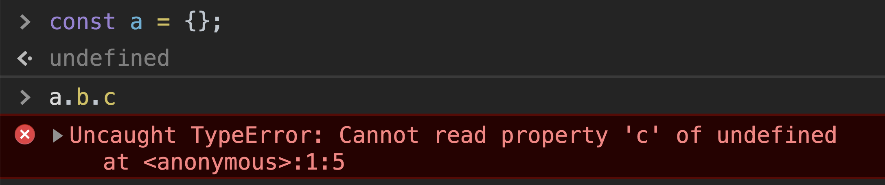
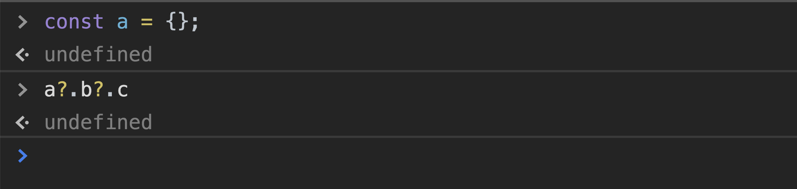

`TypeError: Cannot read property '<property>' of undefined` has bugged every javascript developer enough. While expecting response from APIs, we need to add a number of `&&` to make sure our code don't break. This maybe not a problem while dealing with 2 level nested object, but while dealing with large data objects this can be nightmare. Unnecessary/redundent lines of code, change all occurences if the structure of object changes etc.

But we are now in 2020, the game has been changed with [Optional Chaining proposal](https://github.com/tc39/proposal-optional-chaining) Stage-4.

Now no more redundent lines, but adding `?` before `.` takes care of everything. This traverse the property chain one by one and returns `undefined` if the property dont exist (instead of throwing `TypeError`), else return the value.

Consider following JSON object
```json
{
  solar_system: {
    earth: {
      asia: {
        india: {
          delhi: {
            good_food: true
          }
        }
      }
    }
  }
}
```

The javascript code would look like
```javascript
const data = `<above JSON object>`;
const hasGoodFood = 
  data.solar_system &&
  data.solar_system.earth &&
  data.solar_system.earth.asia &&
  data.solar_system.earth.asia.india &&
  data.solar_system.earth.asia.india.delhi &&
  data.solar_system.earth.asia.india.delhi.good_food;
```

But with optional chaining the whole code can be put into 1 line
```javascript
const data = `<above JSON object>`;
const hasGoodFood = data?.solar_system?.earth?.asia?.india?.delhi?.good_food;
// true;
```

Also
```javascript
const data = `<above JSON object>`;
const hasGoodFood = data?.solar_system?.earth?.asia?.philippines?.delhi?.good_food;
// undefined;
```
The object don't have `philippines`, instead of throwing `TypeError` it returns `undefined`.

This is a [TC39](https://tc39.es/process-document) stage-4 proposal. This means `The addition will be included in the soonest practical standard revision.` in all the modern browsers.

But if you do not want wait for using this already into your code, you can include the [Babel](https://babeljs.io/docs/en/next/babel-plugin-proposal-optional-chaining.html) plugin in your project to support this already.

If you want to see this in action, this can be enabled in chrome browser with following steps:
1. Go to `chrome://flags`
2. Search for `experimental javascript`
3. Toggle the feature to `enable`
4. Relaunch the browser.

---
*Always keep an eye on [TC39](https://github.com/tc39/proposals) proposals for amazing additions to our beloved Javascript

---
  
    


<center><sub>Somethings never change</sub></center>



<center><sub>Somethings do :) </sub></center>


