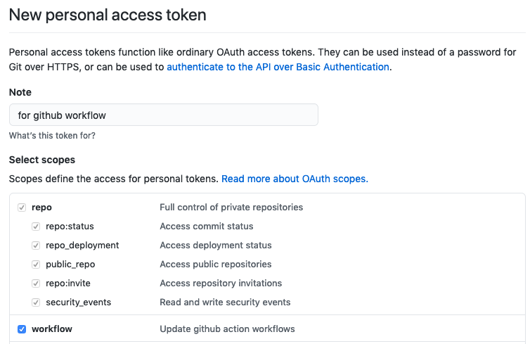
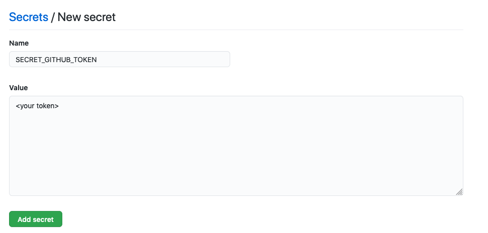

 
GitHub pages are the best way to host static blogs like `Gatsby`. One of the most common ways to do this is, maintain your code in main/master branch, build it, and then push the code to `gh-pages` branch.
There are various CI that easily automate this process like Travis CI, CircleCI, etc.
With GitHub actions, this would be a piece of cake, and without depending on any third-party provider. From the docs: 
> Automate, customize, and execute your software development workflows right in your repository with GitHub Actions`  

If you are not sure what are GitHub actions please visit [here](https://github.com/features/actions).

## <center> Workflow </center>

#### Prerequisites
1. You have a static blog(let's say gatsby) setup, the code for your blog is in master branch.
2. You have a build script in your package.json
3. You have setup your github pages (or pointed to your custom domain) in `gh-pages` branch.

#### Process

**<center> Step 1 </center>**  
Install [gh-pages npm package](https://www.npmjs.com/package/gh-pages) in your project, this is a small utility package which helps to publish your code to gh-pages branch.
You can skip this step in case you want to push all contents from master to `gh-pages` branch.  

**<center>Step 2 </center>**  
Add a deploy script in your `package.json`. This script should do 2 jobs
1. Build the project, make it ready for being published.
2. Push the changes to the `gh-pages` branch.

For example, this pushes the code to `gh-pages` via npm package.
```
"deploy": "gatsby build && gh-pages -d public -r https://$GH_TOKEN@github.com/<username>/<repository_name>.git"
```

**<center>Step 3 </center>**  
Generate an access token and add it to secret of your repository.
1. Create an access token: goto [https://github.com/settings/tokens](https://github.com/settings/tokens), create a new token, give it access for repo and workflow.  


2. Add this token to secret of your repository: goto `https://github.com/<username>/<repository_name>/settings/secrets/actions`, click `new repository secret`.  



**<center>Step 4 </center>**  
1. Create a workflow file, you need to create a file in following path: `.github/workflows/<some-name-you-like>.yml`, its important to have `.yml` extension and have exact same path.
2. Following action file is complete enough to publish `gh-pages`, every time a new commit is merged in master branch. ✅
```YML
   name: gh-pages publisher 🚀

   on:
   push:
      branches: [ master ]

   jobs:
   publish-gh-pages:
      runs-on: ubuntu-latest
      steps:
         - uses: actions/checkout@v2
         - uses: actions/setup-node@v1
         with:
            node-version: 12
         - run: npm ci
         - run: git config user.name "<user name>" && git config user.email "user email"
         - run: npm run deploy
         env:
            GH_TOKEN: ${{secrets.SECRET_GITHUB_TOKEN}}
```

This script is pretty self-explanatory, it performs the following tasks.
   - It specifies to work only on `push` on `master`
   - Sets up a `node 12` environment
   - Installs dependencies via `npm ci`
   - Sets up git requirements for username and email (required to do a push to branch)
   - Run the deploy script
   - In case you don't use gh-pages npm package, you can write another step for git push to gh-pages branch.
   - At last, we set up env variable `GH_TOKEN` from our action secret (which you set up in step 3), this env variable would be available in `package.json`

**Step 5 -**  
Commit this file and see your first `GitHub Action` in action (sorry for the pun 🙈)

You can see the actions running here: `https://github.com/<username>/<repository_name>/actions`.

Workflow file for [itsopensource.com](https://itsopensource.com) can be viewed [here](https://github.com/tsl143/itsopensource/blob/master/.github/workflows/gh-pages-publish.yml).

Hope this helps 🙏🙏🙏

Cheers.
