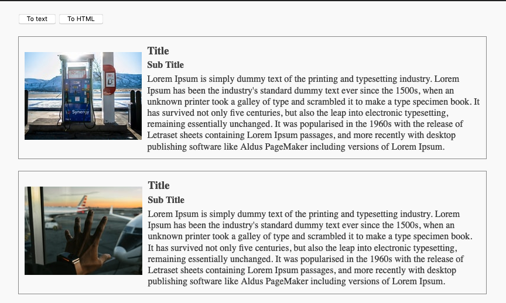
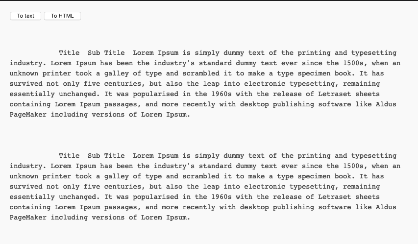

 
One of the features I absolutely love in Firefox is `Firefox Reader View`. This removes all the clutter and present the content in text format for better readability and relief for eyes(It also removes the ad banners 😉 ).

Not all the browsers (Chrome needs special flag to enable this 😐 ) have a redability mode thus, providing an option for reader mode within your website would be a huge help to your users and would make your webpage more accessible.  

The good news is you do not have to implement this on your own, Mozilla has a standalone version of the readability library used for Firefox Reader View - [**Readability.js**](https://github.com/mozilla/readability).  
The usage is pretty simple and straight forward:
1. We need to include the readability.js in our code in either of 2 ways:
    1. Download the file via https://github.com/mozilla/readability/releases
    2. Install npm package - https://www.npmjs.com/package/@mozilla/readability
2. Create a new `Readabilty` object from DOM document node
    ```JS
      const article = new Readability(document).parse();
    ```
    This article object will have following properties
    - `title`: article title
    - `content`: HTML string of processed article content
    - `textContent`: text content of the article (all HTML removed)
    - `length`: length of an article, in characters
    - `excerpt`: article description, or short excerpt from the content
    - `byline`: author metadata
    - `dir`: content direction (LTR or RTL)

    _Note_ Readability morphs the actual object so better to pass a clone node.
    ```JS
    cont documentClone = document.cloneNode(true);
    cont article = new Readability(documentClone).parse();
    ```
3. Substitute this `article.textContent` in the desired div and done 😎

See this in action here - https://itsopensource.com/demos/readability

**<center>HTML View</center>**

  

**<center>Text View</center>**

  


Reference: https://github.com/mozilla/readability
