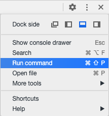
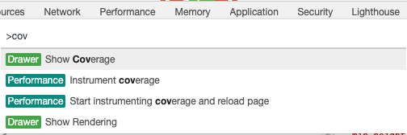
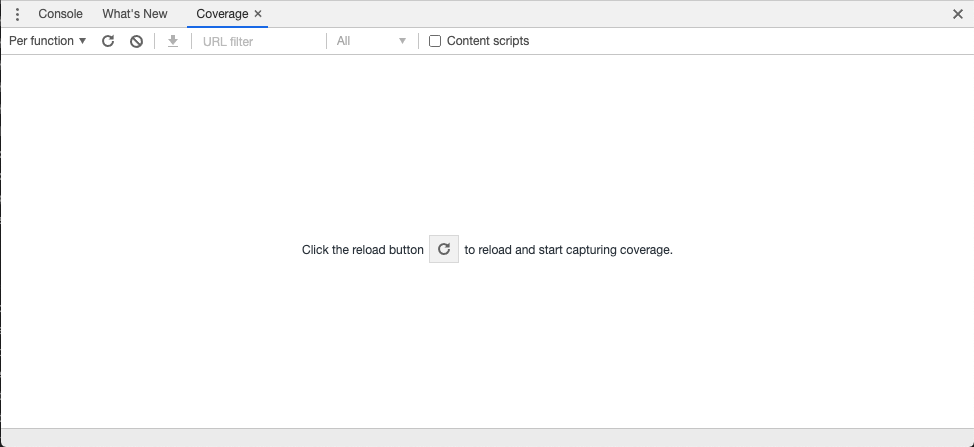
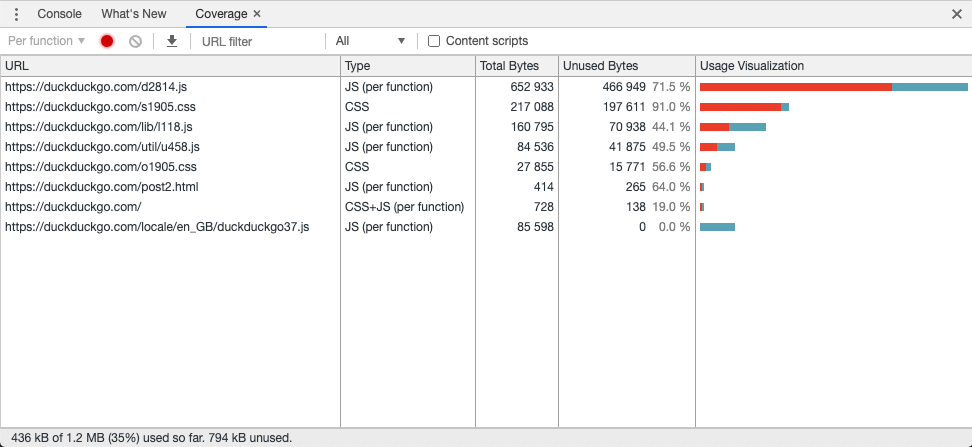

One of the performance wins for the websites is the deferred loading of JS or CSS which are not required at the first load.
While starting a project it's easy to maintain this, over the period of time when there are consistent developments and multiple devs contributing to the project, it may not be that smooth.  
The unused code in general results in slower websites.  
- Unused CSS or JS are generally render blocking resources, which are executed even though they do not make any impact on the loading of the page.  
- Unnecessary data usage impacts more if user is on cellular data.  
- It results in reduced maintainability.

**Chrome** devtools have a coverage panel, where we can observe all the loaded resources(CSS/JS). It displays all the downloaded resources and displays used and unused bytes.  

This panel is not by default visible in devtools, following is how it can be used:
1. Go to the command panel (command/Ctrl + shift + P)    
2. Once the command panel is up, type `coverage`    
3. This will open the coverage panel. Click the reload button in coverage panel.    
4. Each resource is detailed with resource url, type, size, and used/unused bytes/percentage and a small bar graph of the same.  

This just helps us to visualize how much code/CSS is unused at the given page, we need to optimize the code by ourselves ;) For Javascript this is a bit difficult to achieve this via any tool, its more of structuring the code while development and review cycles. For CSS there are few tools that can help to achieve this, some of them can be integrated into the build process.  
Examples :
- [purgeCSS](https://purgecss.com/)
- [purifycss](https://github.com/purifycss/purifycss)
- [uncss](https://github.com/uncss/uncss)
