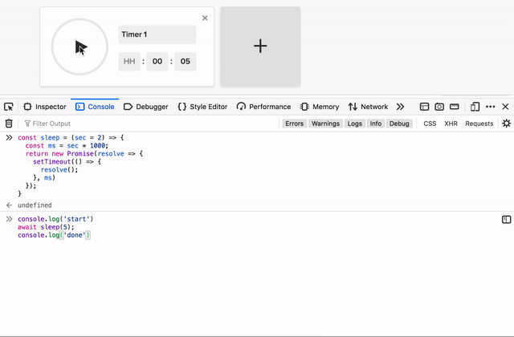

There are times while writing javascript, when we might want to halt the execution of Javascript for small period say 2 seconds. May be while writing test cases, or avoiding race condition, etc. Javascript provides (natively) no way to do this, but we can write our own `sleep` function.

To do this we will use `Promise` / `await`, `setTimeout` (let's just face it no one wants to use `callbacks` anymore 🤐).

<center><sub>The sleep function</sub></center>

```javascript
const sleep = (sec = 2) => {
  const ms = sec * 1000;
  return new Promise(resolve => {
    setTimeout(resolve, ms)
  });
}
```

<center><sub>Usage</sub></center>

```javascript
console.log('start');
const delay = 5; // time in seconds
const taskToBeDoneAfterWait = () => console.log('done');

// with Promise
sleep(delay).then(taskToBeDoneAfterWait);
// this will wait for minimum 3 seconds before executing taskToBeDoneAfterWait

// with await 😎
await sleep(delay);
// execution stopped for 3 seconds
taskToBeDoneAfterWait();
// executed after 3 seconds
```

---
<center><sub>Sleep function in action</sub></center>



That's it, this is all we need to create our own sleep/wait function.  
Hope this helps 😊
