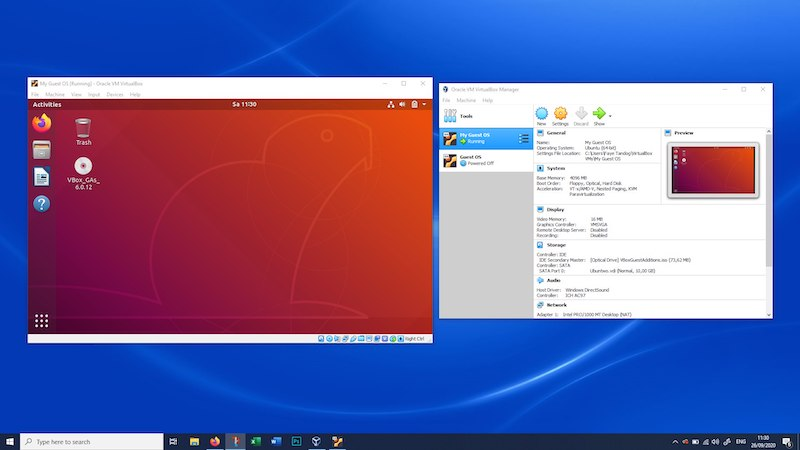
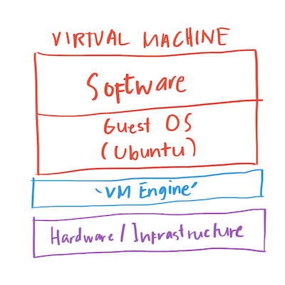
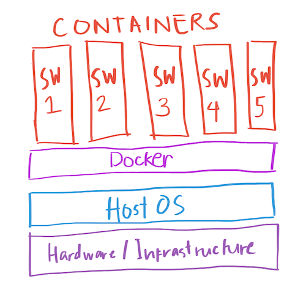

While in principle they are very similar, it might be more common to know about Virtual Machines than Docker Containers. Virtual Machines are like Inception, but with computers; you’re running another computer inside your computer. A usual use-case for this setup that’s applicable even to people not working in tech, is for example, you have a Windows machine (your Host OS) and you want to somehow have Ubuntu (your Guest OS) just to test a software that only runs on Linux machines. You just want to quickly try it out, so you don’t want to go through the process of installing another OS in your system (dual booting).

Now let’s discuss the underlying technology a bit. A virtual machine is a system which emulates a computer system. It has its own CPU, memory, hard disk, network and other hardware resources which are managed by a ‘virtualization layer’. This layer then translates these requests to the physical hardware (host computer).

If you have tried running a VM in your machine, you know how your machine started heating up. This whole process is resource-intensive, because hey, you’re practically running a full version of another machine! That’s definitely something you won’t do when you want to solve a bigger use-case that requires this setup.

What if my colleagues also want to try that software? Do they also have to install the same heavy thing on their system? What if their hardware can’t handle it?

That’s where Docker comes in. It’s like milk, but the leanest version with the least amount of fat that you can find (sort of).

With Docker, you can run applications on your host operating system (e.g. Windows), in what is called a Container. A container is almost similar to an operating system minus the graphical user interface (the stuff you can click). It technically functions just like running a session on a VM, but here’s the magic: unlike in a VM where you have to run a session of an entire OS to use an application, with Docker, you are able to run the application in light-weight containers AND control it from the host OS. The part where you see another OS running? The part where you turn on Ubuntu on your VM Manager that you installed on your Windows machine? That part has been scrapped, making the whole setup way lighter. Instead, you just write some commands on the command line and you go directly into running your application.

_Whuuuut?_

Let’s try to visualize that with this image, compared to our previous one.

The game-changing advantage of Docker is that it allows you to package any software with all of its dependencies into a single standardized unit called image.

Virtual machines run on a host OS and make guest OS available inside each VM, each OS needs to be booted individually. On the other hand, Docker containers are hosted on a single docker engine on a host OS. All the containers share the docker instance. Sharing the engine between containers makes them light and decreases the boot time. While Docker Containers boot in a few seconds, VMs take a few minutes to boot. 

Now that we have that background, let’s take a look at some real examples of how these can be applied:

**Virtual machine**

You have a Windows machine and want to try out GIMP on Ubuntu. Here’s how the process will look like:
1. Install an Ubuntu VM on a Windows machine
2. Go inside the VM window and operate Ubuntu
3. Install GIMP there and use it.

The host OS (Windows) is totally unaware of what is being done inside VM (Ubuntu).

**Docker**

You use Wordpress.com and discovered that there is an open source version of it that you can run yourself, so you want to test it out on your own computer first. Now, setting up a Wordpress site has dependencies, that is, your system needs to have Apache, MySQL database and PHP installed.

Using Docker, here’s how the process will look like.
1. Create a container using a [Wordpress image](https://hub.docker.com/_/wordpress). We’re able to jump directly to this step because the Wordpress image has already been packaged by the Docker community. It contains all the dependencies needed to run Wordpress.
2. Run Wordpress on your browser!

In a nutshell, Docker containers support OS virtualization, and VM supports hardware virtualization.
